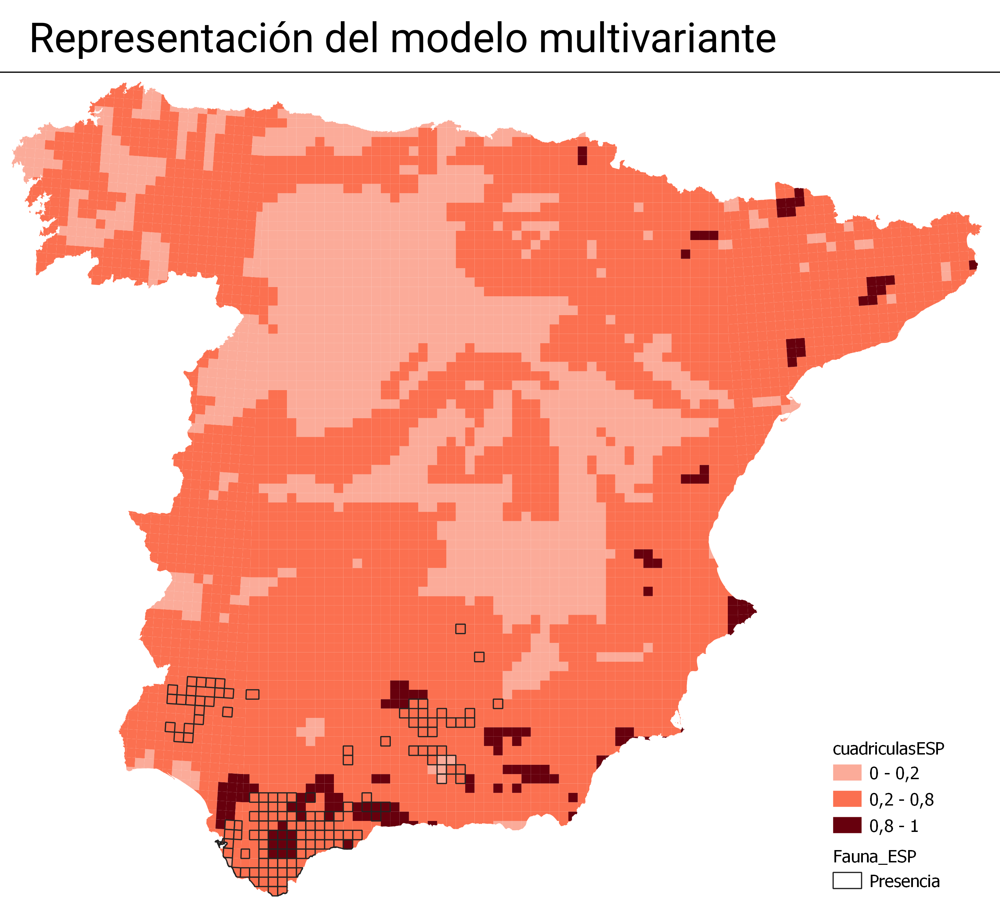
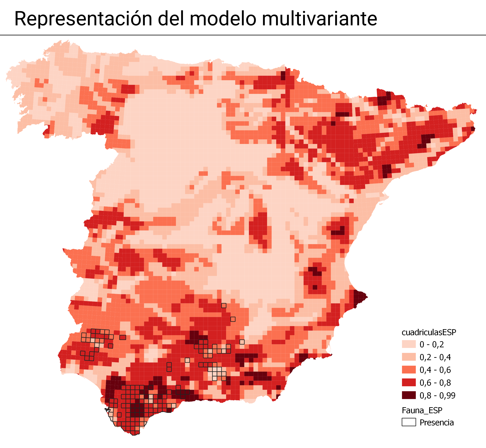

```{r message=FALSE}
library(tidyverse)
library(modEvA)
library(fuzzySim)
library(foreign)
```

```{r}
datos <- read_csv("datos.csv", show_col_types = FALSE) %>% 
  na.omit()
head(datos)
```

Las variables explicativas son:
```{r}
var_explicativas <- datos %>% 
  select(21:54)
```

## Modelo verbal


Según bibliografía: Jimenez-Valverde y Lobo, 2006, concluyen que son las precipitaciones el factor más importante, y en menor medida la temperatura. Siendo la agricultura el factor que incide de forma más negativa.

Utilizando la función de análisis de qgis, representando las variables visualmente y utilizando la bibliografía:

| **VAR** | **Variable**                              | **Factor** | **Hipótesis**                                        | **Intensidad** |
|---------|-------------------------------------------|------------|------------------------------------------------------|----------------|
| LA      | Latitud                                   | Geográfico | Al sur se concentran las poblaciones                 | Fuerte         |
| LOP     | Longitud                                  | Geográfico | Al oeste se concentran las poblaciones               | Fuerte         |
| PMR     | Precipitación máxima relativa (PM24/PMED) | Climático  | Se observa en T entre 12 y 20°C                      | Medio          |
| PREC    | Precipitación media anual                 | Climático  | Asociado a altos valores de precipitación 500 a 2000 | Medio          |
| TMED    | Temperatura media anual                   | Climático  | Se observa en temperaturas entre 12 y 20°C.          | Medio          |

## Modelo univariante

Utilizando las varibales del modelo verbal:

```{r}
LA.MAC_CAL <- glm(MAC_CAL ~ LA, family = binomial, data=datos)
LOP.MAC_CAL <- glm(MAC_CAL ~ LOP, family = binomial, data=datos)
PMR.MAC_CAL <- glm(MAC_CAL ~ PMR, family = binomial, data=datos)
PREC.MAC_CAL <- glm(MAC_CAL ~ PREC, family = binomial, data=datos)
TMED.MAC_CAL <- glm(MAC_CAL ~ TMED, family = binomial, data=datos)
```

```{r}
getModEqn(LA.MAC_CAL, type = "Y", digits = 3)
getModEqn(LA.MAC_CAL, type = "F", digits = 3)

getModEqn(LOP.MAC_CAL, type = "Y", digits = 3)
getModEqn(LOP.MAC_CAL, type = "F", digits = 3)

getModEqn(PMR.MAC_CAL, type = "Y", digits = 3)
getModEqn(PMR.MAC_CAL, type = "F", digits = 3)

getModEqn(PREC.MAC_CAL, type = "Y", digits = 3)
getModEqn(PREC.MAC_CAL, type = "F", digits = 3)

getModEqn(TMED.MAC_CAL, type = "Y", digits = 3)
getModEqn(TMED.MAC_CAL, type = "F", digits = 3)
```

## Modelo multivariante

Utilizando las varibales del modelo verbal:

```{r}
multivar.MAC_CAL <-glm(MAC_CAL ~ LA + LOP + PMR + PREC + TMED, family = binomial, data=datos)
summary(multivar.MAC_CAL)
```

## Exportar el modelo univariante

Creación de una tabla:

```{r}
LA_F <- Fav(model=LA.MAC_CAL)
LA_P <- LA.MAC_CAL$fitted.values

LOP_F <- Fav(model=LOP.MAC_CAL)
LOP_P <- LOP.MAC_CAL$fitted.values

PMR_F <- Fav(model=PMR.MAC_CAL)
PMR_P <- PMR.MAC_CAL$fitted.values

PREC_F <- Fav(model=PREC.MAC_CAL)
PREC_P <- PREC.MAC_CAL$fitted.values

TMED_F <- Fav(model=TMED.MAC_CAL)
TMED_P <- TMED.MAC_CAL$fitted.values

CuadrID <- as.data.frame(datos$CuadrID)

fav.MAC_CAL <- cbind.data.frame(CuadrID, LA_F, LA_P, LOP_F, LOP_P, PMR_F, PMR_P, PREC_F, PREC_P, TMED_F, TMED_P)
colnames(fav.MAC_CAL) <- c("CuadrID", "LA_F", "LA_P", "LOP_F", "LOP_P", "PMR_F", "PMR_P", "PREC_F", "PREC_P", "TMED_F", "TMED_P")

head(fav.MAC_CAL)
```
Exportamos el modelo

```{r}
write.dbf(fav.MAC_CAL, file = "fav.MAC_CAL.dbf")
```

```{r}
multivar_todas.MAC_CAL <-glm(MAC_CAL ~ LOP + LOP2 + LOP3 + LALOP2 + LA2LOP + LALOP + LA2 + LA3 + LA + ORS + ORW + ALTI + ALTI2 + PEND + PEND2 + DAUT + DIHE + DIPR + ESCO + ETP + ETR + HUEN + HUJU + INSO + PERM + PM24 + PMR + PREC + RADS + TENE + TJUL + TMED + U100 + U500, family = binomial, data=datos)
```

# Selección de las variables

Ahora seleccionaremos las variables pero utilizando modelos matemáticos.

## Análisis de multicolinealidad

```{r}
mult <- multicol(var_explicativas)
```

Seleccionamos las filas donde el VIF sea menor igual a 10:
```{r}
mult_selec <- subset(mult, mult$VIF <= 10)
mult_selec
```

Y las variables en texto:
```{r}
paste0(rownames(mult_selec), collapse = "+")
```

## Análisis _False Discovery Rate_

```{r warning=FALSE, message=FALSE}
FDR_MAC_CAL <- FDR(datos, sp.cols = which(colnames(datos)=="MAC_CAL"), var.cols = 21:54, model.type = "GLM")
```

Los siguientes son las variables seleccionadas por FDR:
```{r}
paste0(row.names(FDR_MAC_CAL$select), collapse = "+")
```
## Modelo por pasos

Utilizando las variables seleccionadas por FDR

```{r warning=FALSE, message=FALSE, results="hide"}
pasos.MAC_CAL <- step(glm(MAC_CAL ~ LA+LA2+LA3+ETR+TENE+RADS+DIHE+TMED+LA2LOP+ETP+LOP3+LALOP2+PEND+LALOP+LOP2+U500+TJUL+PERM+PEND2+INSO+LOP+PM24+U100+ALTI+ALTI2+DIPR+PREC+ORW+DAUT, family = binomial, data=datos))
```

```{r}
summary(pasos.MAC_CAL)
```

Vemos que hay algunas variables que no son significativas, para eliminarlas utilizaremos __modelTrim__.

```{r warning=FALSE, message=FALSE}
pasos.MAC_CAL <- modelTrim(pasos.MAC_CAL)
summary(pasos.MAC_CAL)
```

## Resumiendo

Las variables que superaron al análisis de multicolinealidad son:
_DIPR+ESCO+PM24+ETR+HUJU+HUEN+U500+U100+DAUT+PERM+ORW+ORS_

Las seleccionadas por FDR:
_LA+LA2+LA3+ETR+TENE+RADS+DIHE+TMED+LA2LOP+ETP+LOP3+LALOP2+PEND_
_+LALOP+LOP2+U500+TJUL+PERM+PEND2+INSO+LOP+PM24+U100+ALTI+ALTI2+DIPR+PREC+ORW+DAUT_

Y las seleccionadas por FDR se les aplica una selección por pasos:
_LA+DIHE+LA2LOP+ETO+LALOP+TJUL+PERM+PEND2+LOP+PM24+ALTI+ALTI2+DIPR+PREC+DAUT_

Ahora realizo un modelo multivariante usando las variables que superaron los dos filtros, ¿estas serían las que se repiten en ambos modelos? 

_DIPR + PM24 + DAUT + PERM_

```{r}

MATEMATICO.MAC_CAL <- glm(MAC_CAL ~ DIPR + PM24 + DAUT + PERM, family = binomial, data=datos)

MATEMATICO.MAC_CAL_P <- MATEMATICO.MAC_CAL$fitted.values
MATEMATICO.MAC_CAL_P <- as.data.frame(MATEMATICO.MAC_CAL_P)

MATEMATICO.MAC_CAL_F <- Fav(model=MATEMATICO.MAC_CAL)
MATEMATICO.MAC_CAL_F <- as.data.frame(MATEMATICO.MAC_CAL_F)

colnames(CuadrID) <- "CuadrID"

fav.matematico.MAC_CAL <- cbind.data.frame(CuadrID, MATEMATICO.MAC_CAL_P, MATEMATICO.MAC_CAL_F)
head(fav.matematico.MAC_CAL)
```

Y lo guardamos en dbf para exportar a qgis

```{r}
write.dbf(fav.matematico.MAC_CAL, file = "fav.matematico.MAC_CAL.dbf")
```

## Llevando a QGIS

Representación del modelo multivariante, realizado anteriormente.






### multGLM

```{r}
names(datos)
```

```{r}
multGLM.MAC_CAL0 <- multGLM(data = datos, which(colnames(datos)=="MAC_CAL"), var.cols = 21:54, id.col=1, step=TRUE, Fav = TRUE)
save(multGLM.MAC_CAL0, file="multGLM.MAC_CAL0.rda")
```

Considerando FDR:
```{r}
multGLM.MAC_CAL1 <- multGLM(data = datos, which(colnames(datos)=="MAC_CAL"), var.cols = 21:54, id.col=1, step=TRUE, Fav = TRUE, FDR=TRUE)
save(multGLM.MAC_CAL1, file="multGLM.MAC_CAL1.rda")
```

Considerando corSelect:
```{r}
multGLM.MAC_CAL2 <- multGLM(data = datos, which(colnames(datos)=="MAC_CAL"), var.cols = 21:54, id.col=1, step=TRUE, Fav = TRUE, FDR=TRUE, corSelect=TRUE)
save(multGLM.MAC_CAL2, file="multGLM.MAC_CAL2.rda")
```
Utilizando trim:

```{r}
multGLM.MAC_CAL3 <- multGLM(data = datos, which(colnames(datos)=="MAC_CAL"), var.cols = 21:54, id.col=1, step=TRUE, Fav = TRUE, FDR=TRUE, corSelect=TRUE, trim = TRUE)
save(multGLM.MAC_CAL3, file="multGLM.MAC_CAL3.rda")
```

Summary de todos los modelos:

```{r}
summary(multGLM.MAC_CAL0$models$MAC_CAL)
summary(multGLM.MAC_CAL1$models$MAC_CAL)
summary(multGLM.MAC_CAL2$models$MAC_CAL)
summary(multGLM.MAC_CAL3$models$MAC_CAL)
```

```{r message=FALSE, warning=FALSE}
predic0 <- multGLM.MAC_CAL0$predictions %>% 
  rename(P_0= MAC_CAL_P, F_0 =MAC_CAL_F)


predic1 <- multGLM.MAC_CAL1$predictions %>%
  select("MAC_CAL_P", "MAC_CAL_F") %>%
  rename(P_1= MAC_CAL_P, F_1 =MAC_CAL_F)


predic2 <- multGLM.MAC_CAL2$predictions %>%
  select("MAC_CAL_P", "MAC_CAL_F") %>%
  rename(P_2= MAC_CAL_P, F_2 =MAC_CAL_F)

predic3 <- multGLM.MAC_CAL3$predictions %>%
  select("MAC_CAL_P", "MAC_CAL_F") %>%
  rename(P_3= MAC_CAL_P, F_3 =MAC_CAL_F)

predics <- data.frame(predic0, predic1, predic2, predic3)
```

```{r}
write.dbf(predic0, file="fav_MAC_MAL_0.dbf")
write.dbf(predics, file="fav_MAC_MAL_all.dbf")
```

## Evaluando modelo univariante o multivariante

```{r}
auc_modelo <- AUC(model=PREC.MAC_CAL)
```

```{r message=FALSE, warning=FALSE}
eval_mod <- threshMeasures(obs=PREC.MAC_CAL$y,
                           pred=PREC.MAC_CAL$fitted.values,
                           thresh = 0.5)
```

```{r}
head(eval_mod)
```

Gurdamos el modelo
```{r}
save(eval_mod, file="eval_modMAC_CAL")
```

### Lo mismo pero con el multivariante
Error acá:
```{r}
eval1 <- multModEv(models=multGLM.MAC_CAL3$models$MAC_CAL,
                   thresh = 0.5,
                   bind.method = "n.bins",
                   fixed.bin.size = TRUE)
```

```{r}
eval2 <- multModEv(models=multGLM.MAC_CAL3$models[1], thresh = "preval", measures = c("AUC", "CCR", "Sensitivity", "Specificity"))
head(eval2)
```

